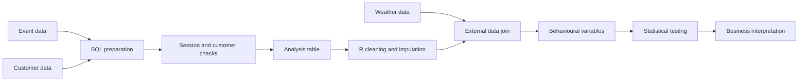

# E-commerce Customer Behaviour & Conversion Analysis

This project looks at how browsing behaviour, device type, customer characteristics, seasonality and weather can be used to study purchase conversion in an e-commerce setting.

It started as a university group project built on a restricted retail database. I led most of the data preparation and cleaning and completed most of the R modelling and hypothesis testing. The written report was produced collaboratively.

The public version focuses on the analytical workflow and code. The original dataset, lookup values and company-specific results are not included because they were provided under an NDA.

## What I worked on

The project had two main parts:

- **SQL:** building the analysis table from event-level and customer-level data, checking joins and session counts, and resolving cases where one browsing session was linked to more than one customer ID.
- **R:** cleaning and restructuring the exported table, handling missing demographic information with MICE, joining external weather data, checking outliers, creating behavioural variables, and testing relationships with conversion.

I kept the public code close to the submitted workflow rather than redesigning the assignment from scratch.

## Analytical workflow



## SQL work

The SQL pipeline:

1. derives a conversion indicator from browsing events;
2. joins session activity to customer characteristics;
3. checks row counts and distinct session counts after the join;
4. identifies sessions associated with multiple customer IDs;
5. uses window functions such as `RANK()` and `FIRST_VALUE()` to select consistent customer information;
6. validates the final table before export to R.

The original project required several intermediate checks because the source data did not behave like a perfectly clean relational model. I kept those checks in the public SQL because they show the reasoning behind the final table, not just the final query.

## R analysis

The R workflow covers:

- data-type cleaning and missing-value inspection;
- multiple imputation with `mice`;
- factor reconstruction after imputation;
- joining daily weather variables to browsing activity;
- Mahalanobis-distance and univariate outlier checks;
- descriptive analysis and visualisation;
- chi-square tests;
- two-sample t-tests;
- linear regression;
- logistic regression;
- interaction terms.

The hypothesis tests examine relationships such as:

- session duration and purchase behaviour;
- device type and conversion;
- repeated product-page visits and purchase behaviour;
- weather and conversion;
- seasonality;
- customer demographics and urbanisation.

I treat these as observational relationships rather than causal effects.

## Why the data is not included

The original retail data was supplied for educational use under confidentiality restrictions. For that reason, this repository does **not** contain:

- the original CSV export;
- the original database tables;
- hashed customer values or lookup mappings;
- the original assignment reports;
- company-specific statistical outputs.

The R script therefore documents the original workflow but is not fully reproducible from this public repository alone.

A fully reproducible public version would require a separately generated synthetic dataset with the same schema and analytical structure.

## Data-quality issues that mattered

A useful part of this project was dealing with problems that were easy to miss if I only focused on modelling:

- some sessions were associated with more than one customer ID;
- some demographic variables were missing;
- cart abandonment had to be derived from event behaviour rather than observed directly;
- customer tracking was not designed to capture all possible device switching;
- external weather data had to be aligned to browsing dates before modelling.

These limitations are part of the analysis rather than something I would hide from the results.

## Repository structure

```text
ecommerce-customer-behavior-analysis/
├── README.md
├── sql/
│   └── 01_build_analysis_table.sql
├── analysis/
│   └── customer_behavior_analysis.R
├── data/
│   └── README.md
├── visuals/
│   └── README.md
├── R-packages.txt
└── .gitignore
```

## Tools

**SQL / PostgreSQL**  
Joins, temporary tables, `CASE`, aggregation, `COALESCE`, window functions, ranking and validation queries.

**R**  
`dplyr`, `ggplot2`, `mice`, `caret`, `RColorBrewer` and `scales`.

## Portfolio note

This was originally a group university project. My contribution was concentrated on the technical side: I led most of the data preparation and cleaning and completed most of the R modelling and hypothesis testing. Report writing was collaborative.

For the public portfolio version, I cleaned the code and documentation while keeping the original analytical approach recognisable.
