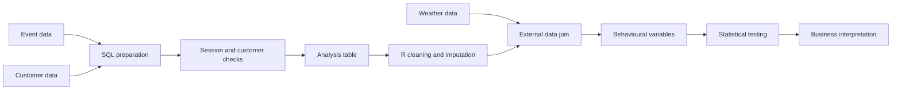
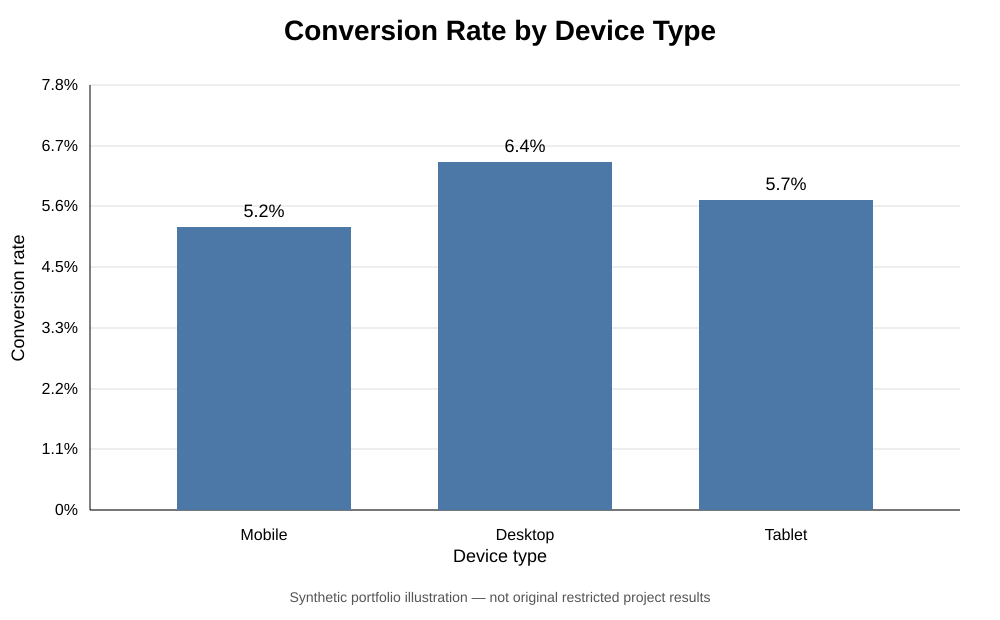
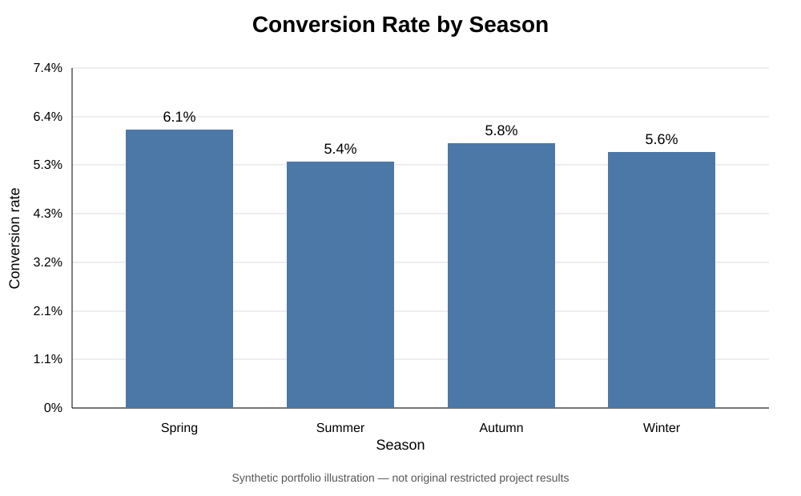
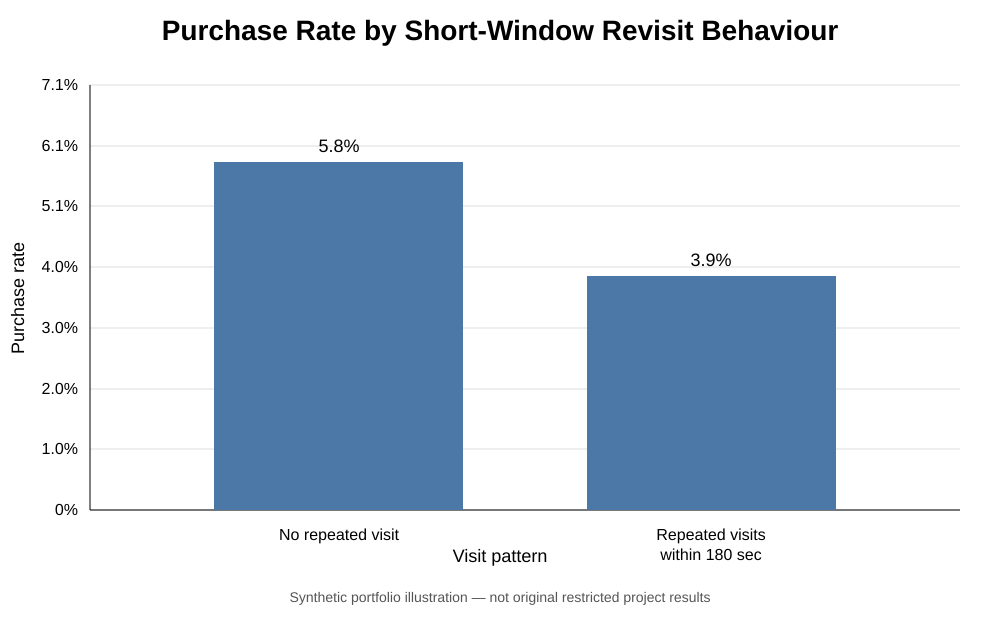

# E-commerce Customer Behaviour & Conversion Analysis

This project examines how browsing behaviour, device type, customer characteristics, seasonality and weather relate to purchase conversion in an e-commerce setting.

It started as a university group project using a restricted retail database. My main contribution was on the technical side: I led most of the data preparation and cleaning and completed most of the R modelling and hypothesis testing. The written report was collaborative.

Because the original retail data and project results were provided under confidentiality restrictions, the public repository does not include the source data or company-specific outputs. The SQL and R files preserve the original analytical workflow as closely as possible.

## What I worked on

The project had two main parts:

- **SQL:** building the analysis table from event-level and customer-level data, checking joins and session counts, and resolving cases where one browsing session was linked to more than one customer ID.
- **R:** cleaning and restructuring the exported table, handling missing demographic information with MICE, joining external weather data, checking outliers, creating behavioural variables, and testing relationships with conversion.

## Analytical workflow



## SQL work

The SQL pipeline:

1. derives a conversion indicator from browsing events;
2. joins session activity to customer characteristics;
3. checks row counts and distinct session counts after the join;
4. identifies sessions associated with multiple customer IDs;
5. uses window functions such as `RANK()` and `FIRST_VALUE()` to select consistent customer information;
6. validates the final table before export to R.

Several intermediate checks are kept in the public SQL because the source data did not behave like a perfectly clean relational model.

## R analysis

The R workflow covers:

- data-type cleaning and missing-value inspection;
- multiple imputation with `mice`;
- factor reconstruction after imputation;
- joining daily weather variables to browsing activity;
- Mahalanobis-distance and univariate outlier checks;
- descriptive analysis and visualisation;
- chi-square tests;
- two-sample t-tests;
- linear regression;
- logistic regression;
- interaction terms.

The hypothesis tests examine relationships such as session duration and purchase behaviour, device type and conversion, repeated product-page visits and purchase behaviour, weather and conversion, seasonality, customer demographics and urbanisation.

These are treated as observational relationships rather than causal effects.

## Portfolio visuals

The original numerical results cannot be republished, so the three charts below use **synthetic portfolio values**. They show the same types of comparisons used in the project without exposing the restricted study outputs.

### Conversion by device type



### Conversion by season



### Purchase rate by short-window revisit behaviour



The values behind these charts are stored in `data/synthetic_visual_values.csv`. They are illustrative only and should not be read as the original project findings.

## Why the original data is not included

The retail data was supplied for educational use under confidentiality restrictions. This repository therefore does **not** contain:

- the original CSV export;
- the original database tables;
- hashed customer values or lookup mappings;
- the original assignment reports;
- company-specific statistical outputs.

The R script documents the original workflow but cannot be run end-to-end without the restricted files.

## Data-quality issues that mattered

A useful part of the project was dealing with problems that were easy to miss if the focus stayed only on modelling:

- some sessions were associated with more than one customer ID;
- some demographic variables were missing;
- cart abandonment had to be derived from event behaviour rather than observed directly;
- customer tracking did not capture every possible device-switching path;
- external weather data had to be aligned to browsing dates before modelling.

## Repository structure

```text
ecommerce-customer-behavior-analysis/
├── README.md
├── sql/
│   └── 01_build_analysis_table.sql
├── analysis/
│   ├── customer_behavior_analysis.R
│   └── 02_generate_synthetic_visuals.R
├── data/
│   ├── README.md
│   └── synthetic_visual_values.csv
├── visuals/
│   ├── conversion_by_device.svg
│   ├── conversion_by_season.svg
│   ├── purchase_rate_by_short_window_visits.svg
│   └── README.md
├── R-packages.txt
└── .gitignore
```

## Tools

**SQL / PostgreSQL**  
Joins, temporary tables, `CASE`, aggregation, `COALESCE`, window functions, ranking and validation queries.

**R**  
`dplyr`, `ggplot2`, `mice`, `caret`, `RColorBrewer` and `scales`.

## Project note

This was originally a group university project. My contribution was concentrated on the technical work: most of the data preparation and cleaning, and most of the R modelling and hypothesis testing.

The public repository was assembled later from the original project materials. File paths, formatting and documentation were edited for portfolio use, while the original analytical logic was kept recognisable.
